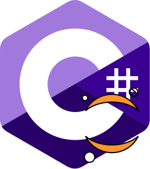
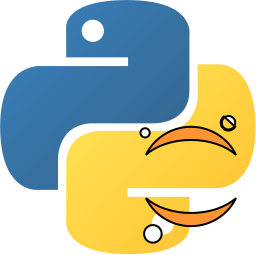

# Об'єктно орієнтоване програмування
Виконав: *Мазур Олег Володимирович*, 190997, варіант 8
> Для перегляду коду рекомендую вибирати ноутбуки, а не файли коду, оскільки вони демонструють функціональність, та описують окремі ділянки коду

## Лабораторна робота 1
### Тема 
*Дослідження механізму одиночного успадкування класів*
### Завдання
1. Дослідити механізм одиночного успадкування класів у мовах програмування *С++* та *С#*
2. Написати програми мовами *С++* та *С#*, що демонструють застосування механізму одиночного
успадкування класів згідно з варіантом

|№    |Опис базового класу|Опис похідного класу|Завдання|
|:---:|-------------------|--------------------|--------|
|8    |Рядки: значення рядка, конструктор з параметром, метод обчислення довжини рядка|Символьні рядки: конструктор з параметром, метод обміну одного заданого символу на інший заданий символ, методи отримання даних об’єкту|Описати класи, об’єкт похідного класу; вивести рядок; обчислити і вивести довжину|
### Виконання
#### Інтерактивне виконання
  
 
 

#### Вихідний код
  
 
 

## Лабораторна робота 2
### Тема 
*Дослідження поліморфізму*
### Завдання
1. Дослідити механізм поліморфізму
2. Дослідити віртуальні функції
3. Написати програми мовами С++ та С# для дослідження поліморфізму згідно з варіантом  

|№    |Опис базового класу|Опис похідного класу|Завдання|
|:---:|-------------------|--------------------|--------|
|8    |Базовий клас *"Фігури"*: віртуальні функції обчислення площі і периметра.|Похідний клас *"Прямокутники"*: координати вершин, конструктор з параметрами, віртуальні функції обчислення площі і периметра. Похідний клас "Коло": радіус, конструктор з параметром, віртуальні функції обчислення площі і периметра|Описати класи, об’єкти цих класів; обчислити і вивести площу та периметр об’єктів, використовуючи поліморфізм (вказівну/посилання базового класу)|
#### Інтерактивне виконання
  
 
 

#### Вихідний код
  
 
 
  
## Лабораторна робота 3
### Тема 
*Дослідження та побудування відносин між класами*
### Мета
Дослідити типи зав’язків між класами в ООП та їх реалізацію на прикладі мов програмування *С++* та *С#*
### Завдання
1. Вивчити типи відношень між класами в ООП
2. Спроектувати об’єктно-орієнтовану модель предметної галузі згідно з варіантом, визначивши
необхідні для цього класи та їх структуру
3. Написати програми мовами програмування С++ та С#, що демонструють випадки створення
класів-контейнерів з об’єктів інших класів згідно з варіантом    

|№    |Опис класів|Завдання|
|:---:|-----------|--------|
|8    |Клас-рядок, який містить методи, необхідні для роботи методів класу-контейнера. Клас-контейнер, який є абстракцією тексту та складається з об’єктів класу-рядка та методів додавання рядка до тексту, видалення рядка з тексту, очищення тексту, приведення всіх символів до верхнього регістру, пошуку заданого рядка в тексті, що повертає кількість знайдених рядків, видалення з тексту всіх рядків заданої довжини|Створити один чи декілька об’єктів-текстів та продемонструвати їх функціональність, застосовуючи операції над текстом|
### Виконання
#### Інтерактивне виконання
  
 

#### Вихідний код
  
 
    
## Курсова робота

[# Перейти до розділу *курсова робота*
<img src="src/icons/All.svg" alt="Jaj" heigth="75px" width="75px" ](Notebooks/4ourth/Main.ipynb)
